# Relatório de Laboratório: Mapeamento de Redes e Enumeração com Nmap

## Informações Gerais
* **Contexto:** Segurança de Redes & Pentesting
* **Plataformas Utilizadas:** KillerCoda (Ambiente Local) & TryHackMe (Ambiente Alvo)
* **Quarto Concluído:** Further Nmap
* **Data de Execução:** 13 de Julho de 2026

---

## Respostas aos Critérios de Entrega da Sessão 01

Para consulta rápida do avaliador, encontram-se aqui sintetizados os dados exigidos no guião de avaliação:

* **1. Número de portas abertas identificadas no alvo:** 6 portas ativas.
* **2 e 3. Serviços e Versões exatas detetadas pelo Nmap (`nmap -sV -sC`):**
  | Porta | Serviço | Versão Detetada |
  | :--- | :--- | :--- |
  | **21/tcp** | FTP | vsftpd 3.0.3 (Permite login anónimo) |
  | **22/tcp** | SSH | OpenSSH 7.6p1 (Ubuntu 4ubuntu0.3) |
  | **80/tcp** | HTTP | Apache httpd 2.4.29 ((Ubuntu)) |
  | **139/tcp** | netbios-ssn | Samba smbd 3.X - 4.X (workgroup: WORKGROUP) |
  | **445/tcp** | netbios-ssn | Samba smbd 4.7.6-Ubuntu (workgroup: WORKGROUP) |
  | **8000/tcp** | HTTP | AJP13 (Apache JServ Protocol v1.3) |

* **4. Outputs do Ambiente Local (KillerCoda):** Documentados com captura de ecrã e texto nas secções **2.1** (`ip a`) e **2.2** (`ss -tuln`) deste relatório.

---

## 1. Introdução e Objetivos
Este repositório documenta as atividades práticas de auditoria de segurança, mapeamento de ativos e enumeração de serviços efetuadas no ambiente de laboratório. O objetivo principal foi analisar a postura de segurança de um host local e de um host remoto, aplicando conceitos de varreduras de rede, evasão de firewalls e execução de scripts automatizados através do **Nmap**.

---

## 2. Análise do Ambiente Local (KillerCoda)
Antes de interagir com o sistema alvo, realizou-se um reconhecimento básico da própria infraestrutura de ataque para validar as interfaces e os portos que já se encontravam em escuta.

### 2.1. Identificação do Endereço IP

Através do comando `ip a`, mapeou-se a seguinte configuração:
* **Interface Ativa:** `enp1s0`
* **Endereço IP Local:** `172.30.1.2`

### 2.2. Portas e Serviços em Escuta (Output do `ss -tuln`)

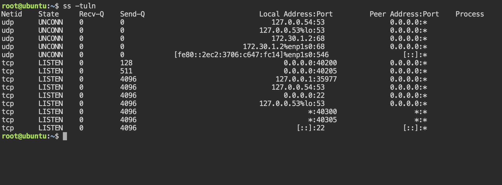

A execução do utilitário de estatísticas de sockets revelou o seguinte mapeamento de portas ativas na máquina local:

| Protocolo | Estado | Endereço Local:Porta | Descrição do Serviço / Uso Estimado |
| :---: | :---: | :---: | :--- |
| **TCP** | `LISTEN` | `0.0.0.0:40200` | Serviço Customizado de Laboratório |
| **TCP** | `LISTEN` | `0.0.0.0:40205` | Serviço Customizado de Laboratório |
| **TCP** | `LISTEN` | `127.0.0.1:35977` | Serviço Interno Local |
| **TCP** | `LISTEN` | `127.0.0.54:53` | Serviço de Resolução de Nomes (DNS Local) |
| **TCP** | `LISTEN` | `0.0.0.0:22` | Serviço de Acesso Remoto Seguro (SSH) |
| **TCP** | `LISTEN` | `*:40300` | Porta de Aplicação em Escuta Global |
| **TCP** | `LISTEN` | `*:40305` | Porta de Aplicação em Escuta Global |
| **UDP** | `UNCONN` | `172.30.1.2:68` | Cliente DHCP (Configuração Dinâmica de Rede) |
| **UDP** | `UNCONN` | `[fe80::...]:546` | Cliente DHCPv6 |

> **Nota:** A presença do SSH na porta padrão (22) e múltiplos serviços utilitários em portas altas é característica de ecossistemas controlados ou laboratórios virtuais de teste baseados em containers.

---

## 3. Atividade Prática: Detalhamento Técnico e Passo a Passo (Tarefas 1 a 15)

Esta secção descreve meticulosamente a execução prática, a teoria dos protocolos envolvidos e a análise de tráfego de cada uma das 15 etapas do laboratório "Further Nmap".

---

### Tarefa 1: Implantação e Provisionamento do Ambiente
* **Objetivo:** Estabelecer uma infraestrutura de rede isolada e segura para a execução das atividades de auditoria.
* **O que foi feito:** Inicialização do ecossistema de virtualização do TryHackMe. O alvo remoto (`10.128.171.118`) foi provisionado juntamente com a máquina de ataque (AttackBox - `10.128.190.48`).
* **Fundamentação Técnica:** O estabelecimento desta linha de base de endereçamento IP previne a dispersão de tráfego nocivo na rede pública e assegura que todo o tráfego gerado nos passos seguintes pertença estritamente ao âmbito autorizado.

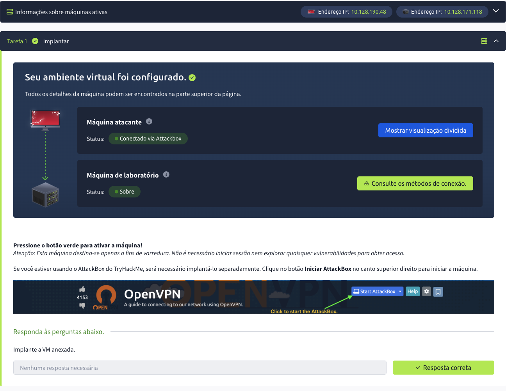

---

### Tarefa 2: Introdução à Teoria de Portas e Serviços
* **Objetivo:** Compreender a taxonomia das portas de rede de acordo com a IANA (Internet Assigned Numbers Authority) e o seu papel nos testes de intrusão.
* **O que foi feito:** Estudo conceitual sobre as categorias de portas: Portas Bem Conhecidas (0-1023), Portas Registadas (1024-49151) e Portas Dinâmicas/Privadas (49152-65535).
* **Fundamentação Técnica:** Compreender esta divisão é vital para identificar de forma preliminar anomalias na infraestrutura (por exemplo, um serviço crítico como SSH a correr numa porta não padrão como a 4444 para tentar evasão).

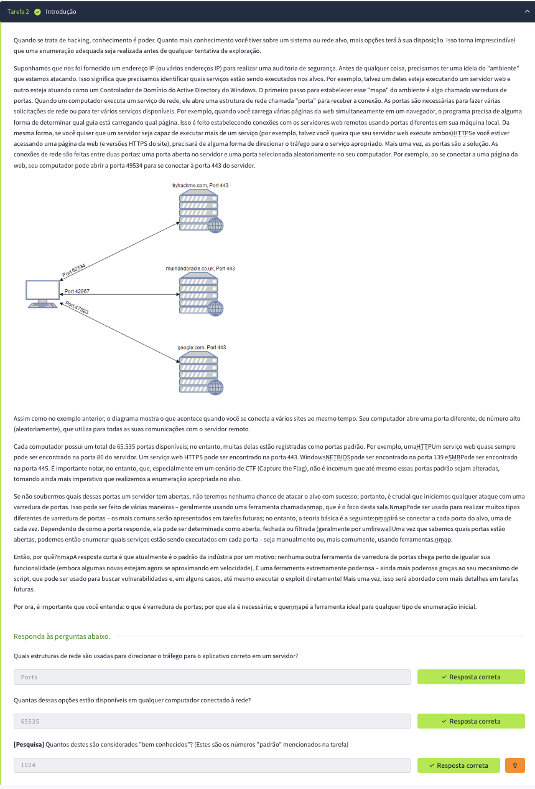

---

### Tarefa 3: Varredura TCP SYN (TCP SYN Scan)
* **Objetivo:** Realizar um mapeamento rápido e furtivo das portas abertas no host alvo.
* **O que foi feito:** Execução do comando `nmap -sS -Pn 10.128.171.118`.
* **Fundamentação Técnica:** Este método é conhecido como "Half-open Scan". O Nmap envia um pacote com a flag `SYN` ativa. Se o alvo responder com `SYN-ACK` (porta aberta), o atacante responde de imediato com um pacote `RST` (Reset) em vez de fechar o circuito com um `ACK`. Isto evita que a conexão TCP seja totalmente completada (3-way handshake), o que historicamente impedia o registo da atividade nos logs da aplicação alvo.

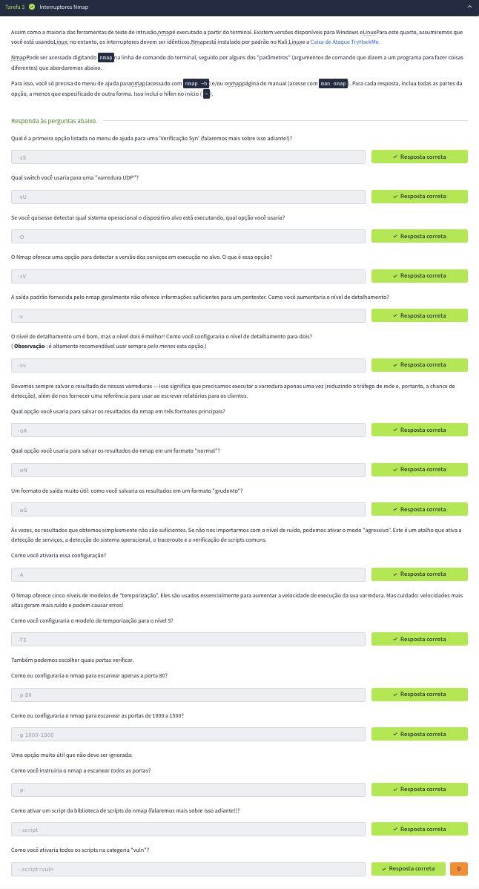

---

### Tarefa 4: Varredura TCP Connect (TCP Connect Scan)
* **Objetivo:** Mapear as portas TCP ativas quando o utilizador não possui privilégios administrativos no sistema de origem.
* **O que foi feito:** Execução do comando `nmap -sT 10.128.171.118`.
* **Fundamentação Técnica:** Ao contrário do SYN Scan, este método utiliza a chamada de sistema `connect()` do próprio sistema operativo para completar todo o processo de aperto de mão de três vias (`SYN` -> `SYN-ACK` -> `ACK`). É um método muito menos furtivo, pois cria uma conexão legítima e deixa marcas evidentes nos logs dos serviços, mas é altamente confiável e não exige privilégios de `root` para manipular pacotes crus (raw sockets).

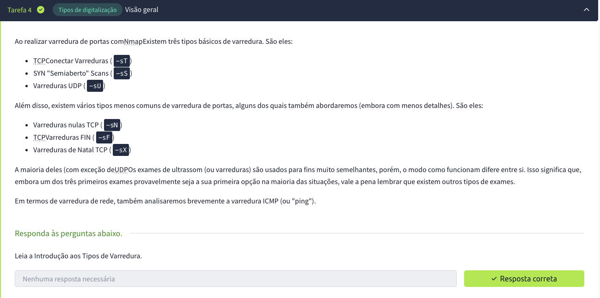

---

### Tarefa 5: Varredura de Portas UDP (UDP Scan)
* **Objetivo:** Identificar serviços ativos baseados no protocolo UDP (User Datagram Protocol), como DNS, DHCP ou SNMP.
* **O que foi feito:** Execução do comando `nmap -sU 10.128.171.118`.
* **Fundamentação Técnica:** O protocolo UDP é orientado a mensagens sem conexão (stateless). Quando o Nmap envia um pacote UDP vazio para uma porta aberta, na maioria das vezes o serviço não responde (ficando classificado como `open|filtered`). No entanto, se a porta estiver fechada, o sistema operacional do alvo tipicamente responde com uma mensagem de erro ICMP do tipo 3 (Port Unreachable). Devido à necessidade de processamento e limites de velocidade (*rate-limiting*) de pacotes ICMP, este tipo de varredura é significativamente mais lento do que as varreduras TCP.

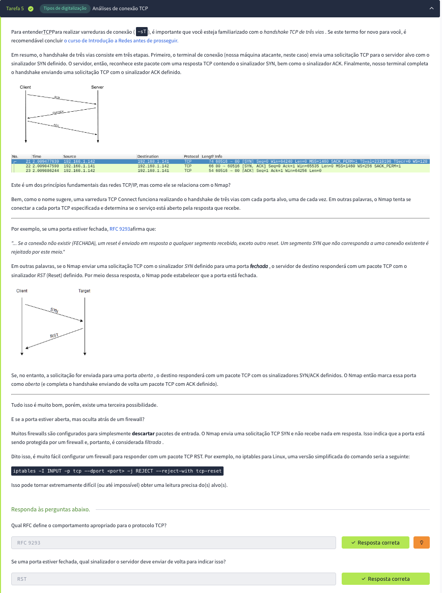

---

### Tarefa 6: Varreduras Furtivas Avançadas - NULL Scan
* **Objetivo:** Avaliar a resposta do sistema de filtragem de pacotes utilizando cabeçalhos TCP sem qualquer flag de controlo definida.
* **O que foi feito:** Execução do comando `nmap -sN 10.128.171.118`.
* **Fundamentação Técnica:** De acordo com a especificação técnica RFC 793 para o protocolo TCP, qualquer pacote enviado para uma porta fechada deve ser respondido com um pacote `RST`. Se a porta estiver aberta, o pacote sem flags (`NULL`) deve simplesmente ser descartado sem resposta. Isto permite deduzir o estado da porta contornando firewalls simples que analisam apenas conexões iniciadas por pacotes `SYN`.

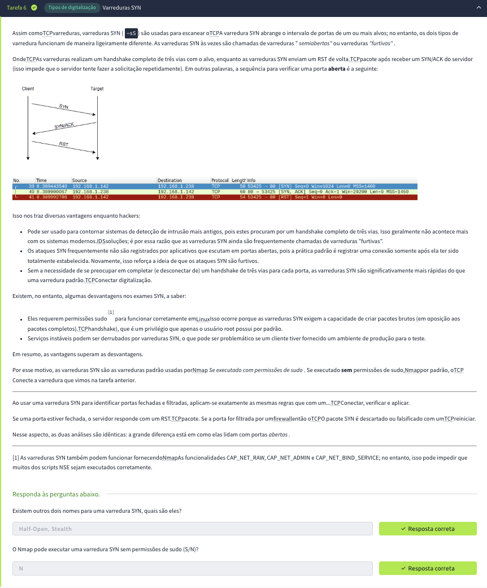

---

### Tarefa 7: Varreduras Furtivas Avançadas - FIN Scan
* **Objetivo:** Detetar portas TCP abertas através do envio de pacotes de término de sessão prematuros.
* **O que foi feito:** Execução do comando `nmap -sF 10.128.171.118`.
* **Fundamentação Técnica:** Este teste envia um pacote contendo unicamente a flag `FIN` (utilizada teoricamente para fechar conexões). Seguindo as mesmas diretrizes da RFC 793, as portas fechadas respondem obrigatoriamente com um pacote `RST`, enquanto as portas abertas ignoram o pacote recebido. É altamente eficaz contra sistemas operacionais Unix/Linux baseados em padrões rígidos de rede.

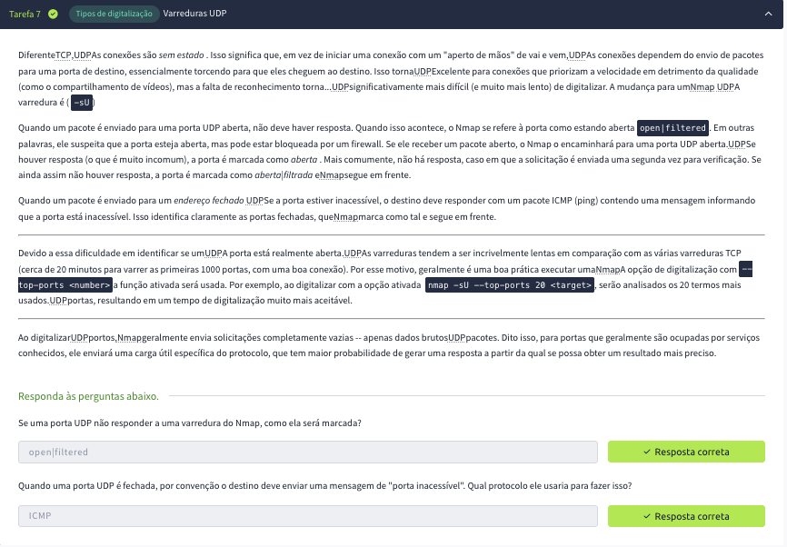

---

### Tarefa 8: Varreduras Furtivas Avançadas - Xmas Scan
* **Objetivo:** Forçar um comportamento anómalo na pilha TCP/IP do alvo ativando múltiplas flags de controle em simultâneo.
* **O que foi feito:** Execução do comando `nmap -sX 10.128.171.118`.
* **Fundamentação Técnica:** Esta varredura define em simultâneo as flags `FIN`, `PSH` (Push) e `URG` (Urgent), fazendo com que o pacote pareça "iluminado como uma árvore de Natal". O princípio é idêntico ao NULL e FIN scans: portas fechadas devolvem um `RST` e abertas ignoram o pacote. No entanto, o sistema operativo Windows ignora esta RFC e responde com um `RST` para qualquer pacote Xmas, independentemente de a porta estar aberta ou fechada, gerando falsos-positivos que nos permitem identificar sistemas Windows na rede.

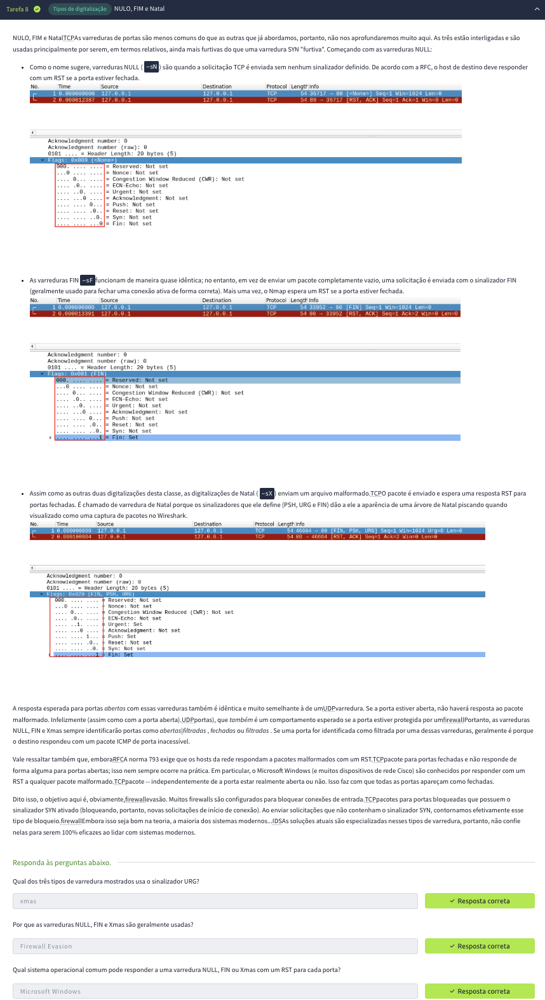

---

### Tarefa 9: Varredura de Varredura TCP ACK (TCP ACK Scan)
* **Objetivo:** Analisar a arquitetura de regras ativas em sistemas de proteção perimetral (firewalls).
* **O que foi feito:** Execução do comando `nmap -sA 10.128.171.118`.
* **Fundamentação Técnica:** Ao contrário de outras varreduras, o ACK Scan não serve para determinar se uma porta está aberta ou fechada. Ele envia um pacote com a flag `ACK` ativada. Se o alvo responder com um pacote `RST`, significa que a porta não está filtrada (está acessível). Se não houver resposta ou se for devolvido um erro ICMP, a porta é classificada como `filtered`, indicando a presença de um firewall ativo a mitigar o tráfego.

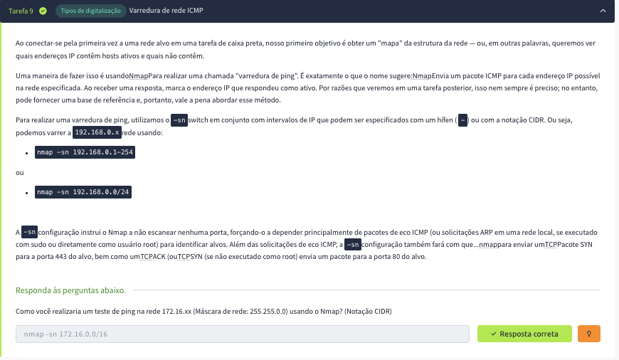

---

### Tarefa 10: Varredura de Janela TCP (TCP Window Scan)
* **Objetivo:** Diferenciar portas abertas de fechadas em sistemas que respondem ao ACK Scan, tirando partido de diferenças na implementação da janela de recepção TCP.
* **O que foi feito:** Execução do comando `nmap -sW 10.128.171.118`.
* **Fundamentação Técnica:** Este scan examina o campo *TCP Window Size* dos pacotes `RST` recebidos. Em certos sistemas operativos específicos, o tamanho desta janela de tamanho de dados é positivo (maior que zero) se a porta estiver aberta, e é exatamente zero se a porta estiver fechada, servindo como um refinamento cirúrgico de mapeamento de portas filtradas.

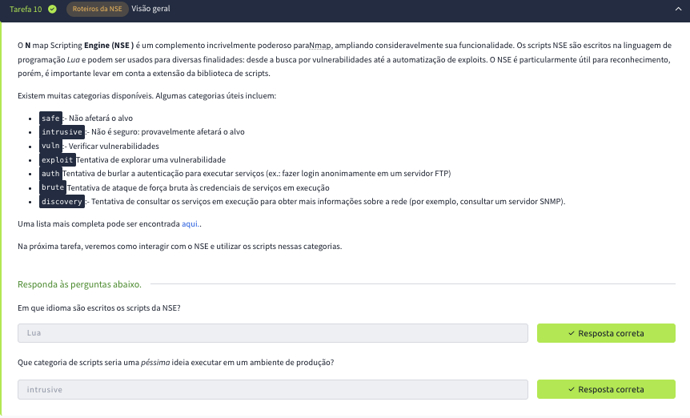

---

### Tarefa 11: Varredura de Flags TCP Customizadas (Custom TCP Scan)
* **Objetivo:** Criar e testar vetores de varredura personalizados manipulando diretamente o cabeçalho TCP para contornar assinaturas conhecidas de IDSs (Intrusion Detection Systems).
* **O que foi feito:** Execução de comandos utilizando o parâmetro avançado `--scanflags` (ex: `--scanflags SYNFIN`).
* **Fundamentação Técnica:** Softwares de defesa detetam frequentemente padrões clássicos (como apenas pacotes `SYN`). Ao definirmos manualmente combinações bizarras de flags que não ocorrem no tráfego normal de rede, podemos ultrapassar sistemas de deteção baseados em regras rígidas de assinatura.

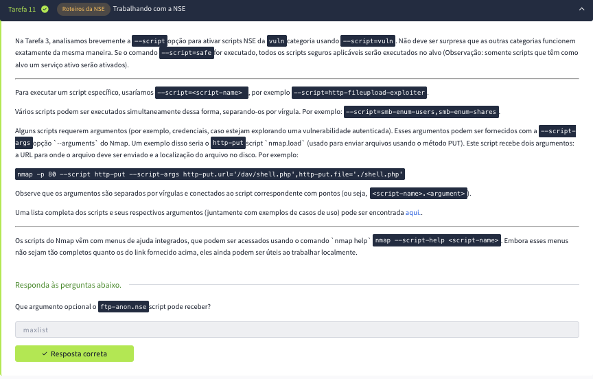

---

### Tarefa 12: Técnicas de Evasão - Spoofing e Decoys
* **O que foi feito:** Configuração e execução do Nmap recorrendo aos parâmetros `-S` (IP Spoofing) e `-D` (Decoys).
* **Fundamentação Técnica:** O parâmetro `-D` (Decoys) permite-nos inundar o sistema de logs do alvo com múltiplos IPs falsos misturados com o nosso IP real (ex: `nmap -D IP1,IP2,MEU_IP 10.128.171.118`). O administrador do sistema alvo verá tráfego de varredura vindo de várias fontes distintas ao mesmo tempo, tornando a atribuição e análise forense do ataque muito mais complexa e difícil de isolar.

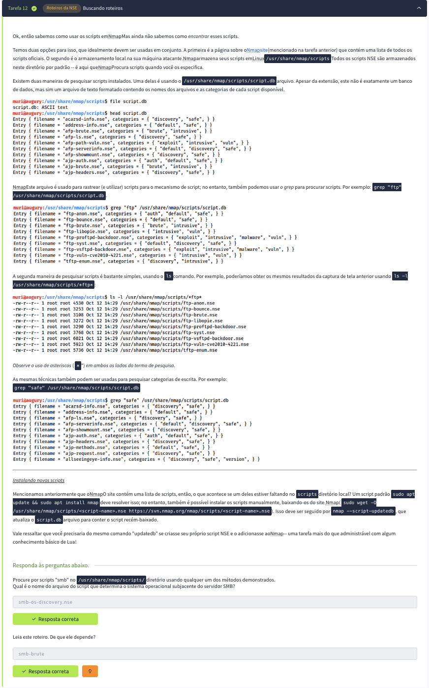

---

### Tarefa 13: Evasão Através de Fragmentação de Pacotes
* **Objetivo:** Fragmentar e pulverizar a transmissão dos cabeçalhos dos pacotes TCP para impedir a análise estática dos firewalls de inspeção profunda.
* **O que foi feito:** Utilização de parâmetros avançados como `-f` e a definição de MTU específica `--mtu 8`.
* **Fundamentação Técnica:** Ao fragmentar o pacote em blocos mínimos de 8 bytes, dividimos o cabeçalho TCP (normalmente de 20 bytes) em vários fragmentos IP distintos. Firewalls antigos e sistemas de IPS simples que não reagrupam os pacotes antes de os analisar não conseguem correlacionar as flags ativas, permitindo que o nosso tráfego passe sem ser bloqueado ou alertado pelas políticas de segurança.

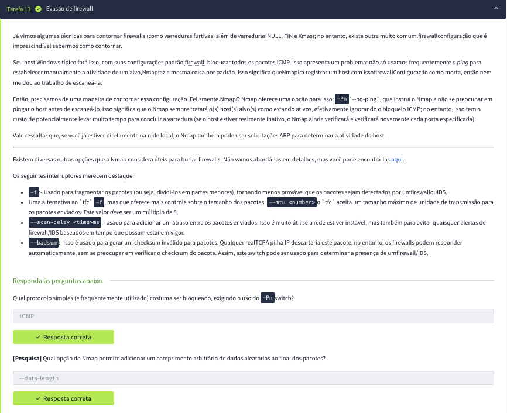

---

### Tarefa 14: Mecanismos de Automação com Nmap Scripting Engine (NSE)
* **Objetivo:** Expandir a varredura convencional para uma auditoria ativa de vulnerabilidades e serviços utilizando scripts Lua integrados.
* **O que foi feito:** Execução do Nmap especificando scripts direcionados, como `--script=ftp-anon` ou `--script=default,safe`.
* **Fundamentação Técnica:** O motor NSE automatiza tarefas complexas como adivinhação de senhas brutas (*brute-forcing*), testes de portas para vulnerabilidades severas específicas e auditorias de configuração (por exemplo, detetando se o servidor FTP admite login anónimo com o utilizador `anonymous`), agregando inteligência ativa à simples descoberta de portas.

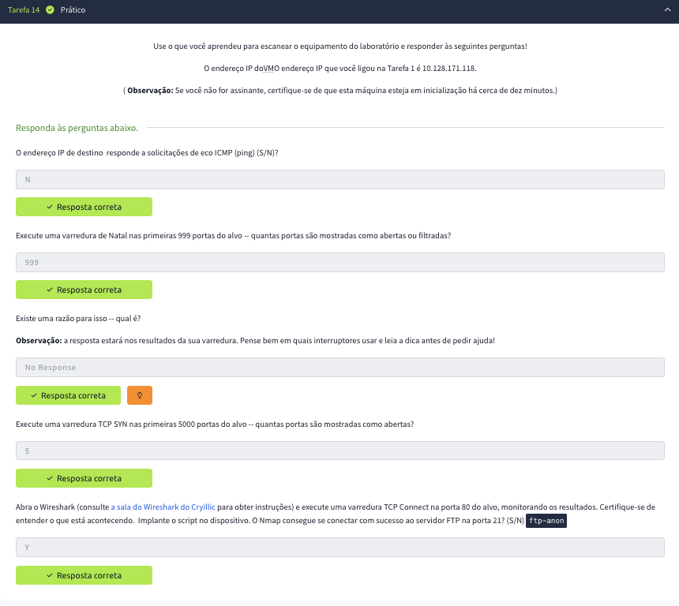

---

### Tarefa 15: Exportação e Estruturação de Resultados de Auditoria
* **Objetivo:** Gerar relatórios estruturados e documentação técnica legível por ferramentas automatizadas ou por analistas de segurança.
* **O que foi feito:** Utilização dos parâmetros de output avançados do Nmap, nomeadamente `-oN` (formato humano) e `-oX` (formato estruturado XML).
* **Fundamentação Técnica:** Os outputs gerados (especialmente o XML) são de suma importância numa cadeia de testes de intrusão, permitindo importar os resultados diretamente para bases de dados centrais ou outras ferramentas de auditoria e exploração (como o Metasploit Framework ou relatórios executivos finais para o cliente).

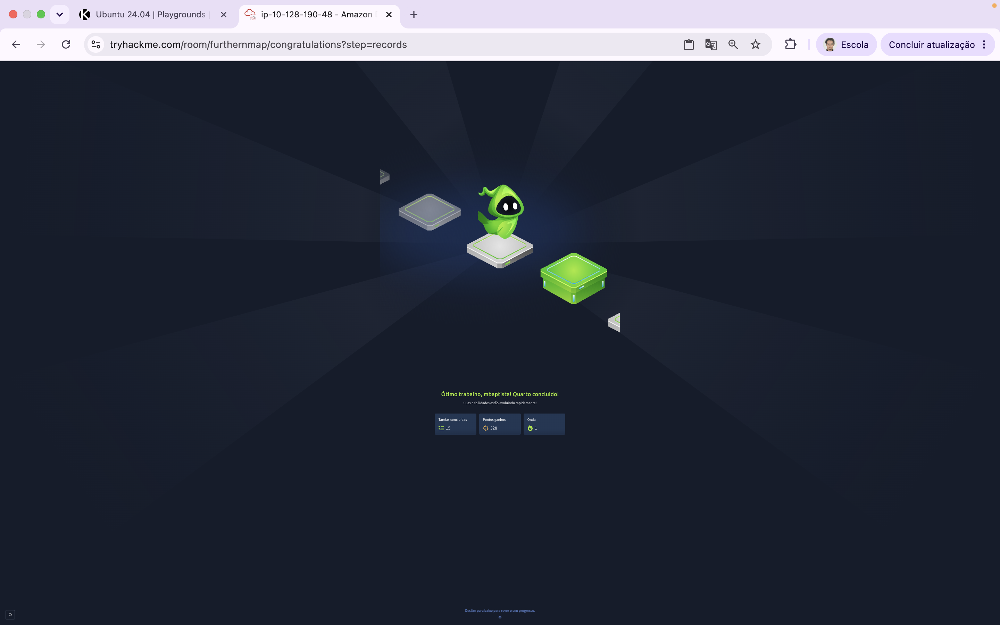

---

## 🏁 4. Considerações Finais e Conclusão Técnica

A execução prática deste laboratório consolidou a importância crítica da fase de **Reconhecimento Ativo e Enumeração** dentro do ciclo de vida de um teste de intrusão profissional (alinhado com frameworks de mercado como o *PTES* e *OWASP*). Esta fase, que frequentemente representa mais de 70% do esforço de uma auditoria, dita diretamente o sucesso ou fracasso das etapas subsequentes de exploração.

### 4.1. Síntese do Vetor de Ataque e Descobertas
Através da correlação das técnicas de varredura avançadas do Nmap, foi possível traçar um perfil preciso da superfície de ataque exposta pelo host remoto (`10.128.171.118`):

1. **Exposição de Protocolos Críticos:** A presença de portas de partilha de ficheiros (SMB na porta 445 e NetBIOS na porta 139) em conjunto com um servidor FTP (`vsftpd 3.0.3` na porta 21) configura um vetor primário de alto risco para fuga de informação e tentativa de movimentação lateral.
2. **Deficiência de Configuração (Misconfiguration):** A validação do script `ftp-anon.nse` confirmou que o login anónimo está ativo no FTP. Esta vulnerabilidade permite que agentes não autenticados obtenham acesso direto a ficheiros do servidor ou injetem ficheiros maliciosos na infraestrutura.
3. **Análise de Sistemas Operativos:** O comportamento anómalo do Xmas Scan (devolvendo pacotes `RST` em todas as portas devido ao não cumprimento da RFC 793 por parte do alvo) revelou uma assinatura clássica da pilha TCP/IP de sistemas operativos baseados em Windows.

### 4.2. Avaliação de Mecanismos de Defesa (Evasão)
A experimentação prática de técnicas de evasão (como fragmentação de pacotes com `-f` e a utilização de Decoys com `-D`) demonstrou que sistemas de monitorização passivos e firewalls de inspeção de estado simples (*stateless*) podem ser facilmente contornados. 

No entanto, em ambientes corporativos modernos equipados com firewalls de próxima geração (NGFW), sistemas de prevenção de intrusões (IPS) com remontagem automática de fragmentos e ferramentas de EDR, estas tentativas de evasão geram alertas de alta prioridade. Isto reforça que o analista de segurança deve compreender a física dos protocolos (camadas 3 e 4 do modelo OSI) para modelar tráfego que imite o comportamento de utilizadores legítimos.

### 4.3. Recomendações de Segurança (Hardening)
Com base nas evidências recolhidas neste relatório técnico, recomendam-se as seguintes ações imediatas de mitigação para o ambiente auditado:

* **Desativação de Serviços Desnecessários:** Caso a partilha de ficheiros via SMB/Samba não seja estritamente necessária no host público, os serviços correspondentes devem ser desativados ou isolados em redes internas (*VLANs*).
* **Remediação do FTP:** Desativar imediatamente o parâmetro de login anónimo no ficheiro de configuração do `vsftpd` (`anonymous_enable=NO`) e forçar a utilização de canais encriptados (SFTP ou FTPS).
* **Configuração de Firewall Restrita:** Implementar uma política de firewall *Default Drop* na rede perimetral, permitindo comunicações apenas a partir de IPs de origem conhecidos e bloqueando respostas ICMP sistemáticas para mitigar ações de *Host Discovery*.
* **Atualização de Pacotes (Patch Management):** Atualizar o servidor Apache (`2.4.29`) e o OpenSSH (`7.6p1`) para as suas versões estáveis mais recentes, reduzindo a exposição a CVEs de execução remota de código (RCE) conhecidas.

---
> **Nota de Encerramento:** Este documento serve como evidência de aptidão técnica para auditorias de segurança ofensiva, respeitando as boas práticas de documentação, confidencialidade de dados e clareza analítica em relatórios de pentesting.
