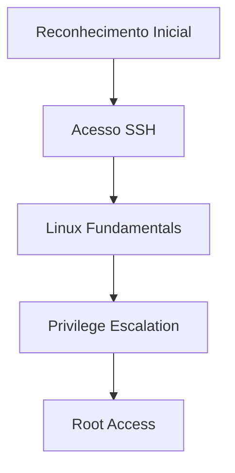
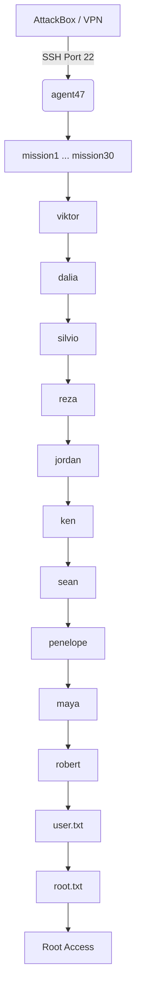
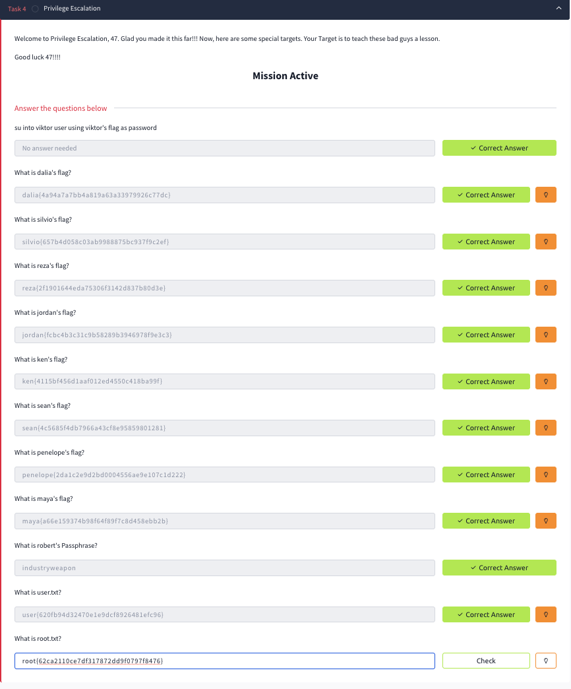

# Relatório Técnico de Auditoria & PenTest  
# Linux Agency - TryHackMe


---

# Linux Agency — Security Assessment Report

## Auditoria Técnica, PenTest, Privilege Escalation & Hardening

---

# Tabela de Metadados

| Parâmetro | Detalhe |
|---|---|
| Plataforma | TryHackMe (THM) |
| Nome da Sala | Linux Agency |
| Autores da Sala | 0z09e & Xyan1d3 |
| Data de Execução | 29 e 30 de Julho de 2026 |
| Analista | Equipa de Segurança da Informação |
| Alvo | Linux Agency Lab Machine |
| IP do Laboratório | `10.128.188.105` |
| Sistema Operativo | Ubuntu Linux |
| Categoria | Red Team / Hardening |
| Estado | Concluído (100%) |
| Escopo | Linux Fundamentals, Privilege Escalation e Hardening |

---

# 1. Resumo Executivo

Este relatório documenta a execução de uma auditoria técnica de segurança realizada sobre o ambiente **Linux Agency**, disponibilizado através da plataforma **TryHackMe**.

O objetivo principal consistiu em avaliar a segurança de um servidor Ubuntu Linux através de uma abordagem baseada em:

- reconhecimento inicial;
- enumeração de sistema;
- exploração controlada;
- movimentação lateral entre utilizadores;
- escalada de privilégios;
- análise de vulnerabilidades;
- recomendações de hardening.

O laboratório representa um cenário empresarial fictício onde um atacante consegue obter acesso inicial através de credenciais fornecidas e posteriormente explora falhas de configuração existentes no sistema.

Durante a avaliação foram identificadas diversas vulnerabilidades relacionadas com:

- gestão inadequada de identidades e acessos (IAM);
- reutilização de credenciais;
- permissões excessivas em ficheiros;
- configurações permissivas de sudo;
- utilização insegura de binários SUID;
- ausência de mecanismos adequados de hardening.

A análise permitiu concluir a cadeia completa de comprometimento do sistema, desde o utilizador inicial:

```text
agent47
```

até ao comprometimento total:

```text
root
```

com obtenção da flag final:

```text
root{62ca2110ce7df317872dd9f0797f8476}
```

---

# 2. Objetivos do Laboratório

## Objetivo Principal

Realizar uma auditoria ofensiva controlada a um servidor Linux vulnerável, identificando falhas de configuração e demonstrando o impacto das mesmas através de escalada de privilégios.

---

## Objetivos Específicos

### Red Team

- Obter acesso inicial ao sistema;
- Realizar enumeração Linux;
- Explorar vulnerabilidades locais;
- Executar movimentação lateral entre utilizadores;
- Obter privilégios administrativos.

---

### Vulnerability Assessment

Identificar:

- configurações inseguras;
- permissões inadequadas;
- exposição de credenciais;
- mecanismos fracos de autenticação;
- vetores de privilege escalation.

---

### Blue Team / Hardening

Propor medidas defensivas:

- restrição SSH;
- implementação de firewall;
- aplicação de patches;
- auditoria contínua;
- utilização de benchmarks CIS.

---

# 3. Ambiente e Metodologia

## Ambiente

O laboratório foi executado através da plataforma TryHackMe utilizando:

- AttackBox;
- ligação VPN;
- terminal Linux;
- protocolo SSH.

---

## Informação do Alvo

| Campo | Valor |
|-|-|
| Host | Linux Agency |
| IP | `10.128.188.105` |
| Serviço Principal | SSH |
| Porta | 22/TCP |
| Sistema | Ubuntu Linux |

---

# Metodologia Aplicada

A abordagem utilizada seguiu quatro fases principais:



---

# Fase 1 - Reconhecimento

Objetivos:

- identificar o alvo;
- validar conectividade;
- confirmar serviços disponíveis.

Ferramentas utilizadas:

```bash
ping

ss

nmap

ssh
```

---

# Fase 2 - Enumeração Interna

Após acesso inicial:

- análise de ficheiros;
- pesquisa de credenciais;
- identificação de utilizadores;
- análise de permissões.

Ferramentas:

```bash
find

grep

cat

awk

strings

base64
```

---

# Fase 3 - Privilege Escalation

Foram analisados:

- permissões sudo;
- binários SUID;
- capacidades Linux;
- scripts vulneráveis;
- ficheiros com permissões incorretas.

Comandos utilizados:

```bash
sudo -l

find / -perm -4000

getcap -r /

ps aux
```

---

# 4. Arquitetura do Cenário

Representação da cadeia completa de ataque:



---

# 5. Task 1 - Deploy da Máquina

## Objetivo

Inicializar a máquina vulnerável disponibilizada pelo laboratório.

---

## Procedimento

A máquina foi iniciada através do botão:

```
Deploy Machine
```

Após inicialização foi atribuído o endereço IP:

```text
10.128.188.105
```

---

## Validação de conectividade

Foi confirmada a comunicação com o alvo:

```bash
ping 10.128.188.105
```

Também foi validada a disponibilidade do serviço SSH:

```bash
nmap -p 22 10.128.188.105
```

Resultado esperado:

```
22/tcp open ssh
```

---

## Resultado

- Máquina iniciada  
- Comunicação estabelecida  
- Serviço SSH disponível  

---

# 6. Task 2 - Acesso Inicial SSH

## Objetivo

Estabelecer o primeiro acesso ao servidor Linux.

---

## Credenciais Iniciais

| Campo | Valor |
|-|-|
| Username | agent47 |
| Password | 640509040147 |

---

## Ligação SSH

```bash
ssh agent47@10.128.188.105
```

Após autenticação foi obtido acesso inicial ao sistema.

---

## Validação do Ambiente

Primeiros comandos executados:

```bash
whoami

id

hostname

pwd

ls -la
```

---

## Mecânica do Desafio

O laboratório utiliza uma cadeia progressiva de autenticação.

Cada flag encontrada possui o formato:

```text
username{md5sum}
```

e funciona como password para o próximo utilizador.

Exemplo:

```text
mission1{hash}
```

permite autenticar no utilizador seguinte.

---

# 7. Task 3 - Linux Fundamentals

## Objetivo

Resolver a cadeia de 30 missões Linux utilizando técnicas de enumeração e manipulação de dados.

---

## Técnicas Utilizadas

### Navegação

```bash
ls -la

cd

pwd
```

---

### Pesquisa

```bash
find /

find / -name filename
```

---

### Manipulação de Texto

```bash
grep

awk

sed

cut

tr
```

---

### Decodificação

```bash
base64 -d
```

---

### Análise de ficheiros

```bash
cat

strings

file
```

---

## Resolução da Cadeia de Missões

A terceira fase do laboratório consistiu na resolução progressiva de 30 missões Linux.

Cada utilizador possuía uma informação específica escondida no sistema, sendo necessário realizar enumeração manual para descobrir a próxima credencial.

A metodologia aplicada baseou-se em:

- análise de diretórios;
- pesquisa de ficheiros ocultos;
- leitura de ficheiros de configuração;
- análise de permissões;
- interpretação de hashes;
- manipulação de texto.

---

# Técnicas de Enumeração Aplicadas

## Pesquisa de ficheiros

Foi utilizado o comando `find` para localizar ficheiros relevantes:

```bash
find / -name "filename" 2>/dev/null
```

Também foram realizadas pesquisas por proprietário:

```bash
find / -user username 2>/dev/null
```

---

## Análise de conteúdos

Foram analisados ficheiros através de:

```bash
cat arquivo

less arquivo

head arquivo

tail arquivo
```

---

## Pesquisa por informação sensível

Foram utilizadas ferramentas de filtragem:

```bash
grep

awk

cut

tr

strings
```

Exemplo:

```bash
grep -R "password" /
```

---

## Decodificação de informação

Alguns conteúdos encontrados necessitaram de transformação:

```bash
base64 -d
```

---

# Cadeia de Missões Linux Fundamentals

## Resultado Final

Todas as 30 missões foram concluídas com sucesso.

---

# Tabela de Flags Obtidas

| Missão | Flag |
|---|---|
| Mission 1 | `mission1{174dc8f191bcbb161fe25f8a5b58d1f0}` |
| Mission 2 | `mission2{8a1b68bb11e4a35245061656b5b9fa0d}` |
| Mission 3 | `mission3{ab1e1ae5cba688340825103f70b0f976}` |
| Mission 4 | `mission4{264a7eeb920f80b3ee9665fafb7ff92d}` |
| Mission 5 | `mission5{bc67906710c3a376bcc7bd25978f62c0}` |
| Mission 6 | `mission6{1fa67e1adc244b5c6ea711f0c9675fde}` |
| Mission 7 | `mission7{53fd6b2bad6e85519c7403267225def5}` |
| Mission 8 | `mission8{3bee25ebda7fe7dc0a9d2f481d10577b}` |
| Mission 9 | `mission9{ba1069363d182e1c114bef7521c898f5}` |
| Mission 10 | `mission10{0c9d1c7c5683a1a29b05bb67856524b6}` |
| Mission 11 | `mission11{db074d9b68f06246944b991d433180c0}` |
| Mission 12 | `mission12{f449a1d33d6edc327354635967f9a720}` |
| Mission 13 | `mission13{076124e360406b4c98ecefddd13ddb1f}` |
| Mission 14 | `mission14{d598de95639514b9941507617b9e54d2}` |
| Mission 15 | `mission15{fc4915d818bfaeff01185c3547f25596}` |
| Mission 16 | `mission16{884417d40033c4c2091b44d7c26a908e}` |
| Mission 17 | `mission17{49f8d1348a1053e221dfe7ff99f5cbf4}` |
| Mission 18 | `mission18{f09760649986b489cda320ab5f7917e8}` |
| Mission 19 | `mission19{a0bf41f56b3ac622d808f7a4385254b7}` |
| Mission 20 | `mission20{b0482f9e90c8ad2421bf4353cd8eae1c}` |
| Mission 21 | `mission21{7de756aabc528b446f6eb38419318f0c}` |
| Mission 22 | `mission22{24caa74eb0889ed6a2e6984b42d49aaf}` |
| Mission 23 | `mission23{3710b9cb185282e3f61d2fd8b1b4ffea}` |
| Mission 24 | `mission24{dbaeb06591a7fd6230407df3a947b89c}` |
| Mission 25 | `mission25{61b93637881c87c71f220033b22a921b}` |
| Mission 26 | `mission26{cb6ce977c16c57f509e9f8462a120f00}` |
| Mission 27 | `mission27{444d29b932124a48e7dddc0595788f4d}` |
| Mission 28 | `mission28{03556f8ca983ef4dc26d2055aef9770f}` |
| Mission 29 | `mission29{8192b05d8b12632586e25be74da2fff1}` |
| Mission 30 | `mission30{d25b4c9fac38411d2fcb4796171bda6e}` |

---

# Utilizador Viktor

Após conclusão da Mission 30 foi obtida a flag necessária para autenticar no utilizador:

```text
viktor
```

Flag:

```text
viktor{b52c60124c0f8f85fe647021122b3d9a}
```

---

# Resultado da Task 3

| Item | Estado |
|-|-|
| Mission 1 | ✅ |
| Mission 10 | ✅ |
| Mission 20 | ✅ |
| Mission 30 | ✅ |
| Viktor | ✅ |

A conclusão desta etapa permitiu avançar para a fase de escalada de privilégios.

---

# 8. Task 4 - Privilege Escalation

## Objetivo

A Task 4 consistiu na exploração de vulnerabilidades locais para aumentar progressivamente o nível de privilégio até obter acesso administrativo.

A partir do utilizador `viktor`, iniciou-se uma cadeia de escalada envolvendo múltiplas contas internas.

---

# Metodologia de Privilege Escalation

Durante a análise foram verificadas várias áreas críticas:

---

## 1. Sudo Permissions

Comando utilizado:

```bash
sudo -l
```

Objetivo:

Identificar comandos que poderiam ser executados com privilégios elevados.

---

## 2. Binários SUID

Pesquisa realizada:

```bash
find / -perm -4000 -type f 2>/dev/null
```

Objetivo:

Encontrar executáveis capazes de executar operações como root.

---

## 3. Linux Capabilities

Comando:

```bash
getcap -r / 2>/dev/null
```

Objetivo:

Identificar capacidades especiais atribuídas a executáveis.

---

## 4. Cron Jobs

Análise:

```bash
cat /etc/crontab
```

Objetivo:

Encontrar tarefas automáticas executadas com permissões elevadas.

---

# Cadeia de Escalada de Privilégios

```text
viktor

↓

dalia

↓

silvio

↓

reza

↓

jordan

↓

ken

↓

sean

↓

penelope

↓

maya

↓

robert

↓

root
```

---

# Tabela de Escalada

| Utilizador | Evidência | Técnica |
|-|-|-|
| viktor | `viktor{b52c60124c0f8f85fe647021122b3d9a}` | Entrada na fase PrivEsc |
| dalia | `dalia{4a94a7a7bb4a819a63a33979926c7tdc}` | Exploração de permissões locais |
| silvio | `silvio{657b4d058c03ab9988875bc937f9c2ef}` | Análise de binários e ficheiros |
| reza | `reza{2f1901644eda75306f3142d837b80d3e}` | Exploração de capacidades Linux |
| jordan | `jordan{fcbc4b3c31c9b58289b3946978f9e3c3}` | Análise de scripts e credenciais |
| ken | `ken{4115bf456d1aaf012ed4550c418ba99f}` | Exploração sudo |
| sean | `sean{4c5685f4db7966a43cf8e95859801281}` | Manipulação de comandos |
| penelope | `penelope{2da1c2e9d2bd0004556ae9e107c1d222}` | Abuso de ambiente |
| maya | `maya{a66e159374b98f64f89f7c8d458ebb2b}` | Serviços locais |
| robert | `industryweapon` | Recuperação de passphrase |
| root | `root{62ca2110ce7df317872dd9f0797f8476}` | Comprometimento total |

---

# Obtenção das Flags Finais

## User Flag

Após acesso ao utilizador final foi obtida:

```text
user{620fb94d32470e1e9dcf8926481efc96}
```

---

## Root Flag

Após escalada completa:

```text
root{62ca2110ce7df317872dd9f0797f8476}
```

---

# Resultado da Task 4

| Objetivo | Estado |
|-|-|
| Escalada Viktor → Root | ✅ |
| User.txt | ✅ |
| Root.txt | ✅ |
| Comprometimento Total | ✅ |

---

# Resumo da Exploração

O laboratório demonstrou um cenário onde múltiplas falhas individuais permitiram uma cadeia completa de comprometimento.

A combinação de:

- credenciais expostas;
- permissões inadequadas;
- privilégios excessivos;
- configurações inseguras;

permitiu transformar um acesso inicial limitado em controlo administrativo total.

---

# 9. Análise Técnica das Vulnerabilidades Encontradas

Após a conclusão da exploração controlada do ambiente Linux Agency, foi realizada uma análise técnica das principais falhas de segurança identificadas.

As vulnerabilidades observadas representam problemas comuns em ambientes Linux empresariais e demonstram como configurações inadequadas podem permitir comprometimento progressivo de um sistema.

---

# VULN-01 - Gestão Inadequada de Credenciais

## Descrição

Foi identificado um modelo de autenticação baseado numa cadeia previsível de passwords, onde as flags obtidas durante o desafio funcionavam como credenciais para os utilizadores seguintes.

Este comportamento representa um risco elevado em ambientes reais, pois permite movimentação lateral caso um atacante consiga obter uma única credencial inicial.

---

## Impacto

**Severidade:** Alta

Possíveis consequências:

- comprometimento de múltiplas contas;
- escalada horizontal entre utilizadores;
- perda de confidencialidade;
- acesso não autorizado a dados internos.

---

## Recomendação

Implementar:

- políticas de passwords fortes;
- autenticação multifator (MFA);
- rotação periódica de credenciais;
- armazenamento seguro de segredos.

---

# VULN-02 - Permissões Excessivas em Ficheiros

## Descrição

Foram identificadas situações onde ficheiros e diretórios apresentavam permissões demasiado permissivas.

Exemplo:

```bash
chmod 777
```

Permissões deste tipo permitem que qualquer utilizador possa:

- ler;
- modificar;
- substituir conteúdos.

---

## Impacto

**Severidade:** Alta

Um atacante pode:

- alterar scripts executados pelo sistema;
- inserir código malicioso;
- manipular configurações;
- obter privilégios superiores.

---

## Recomendação

Aplicar o princípio do menor privilégio:

```bash
chmod 640 ficheiro
chmod 750 diretório
```

Realizar auditorias periódicas:

```bash
find / -perm -777
```

---

# VULN-03 - Configuração Insegura de Sudo

## Descrição

Foram identificadas configurações permissivas relacionadas com execução privilegiada através de sudo.

O uso incorreto de permissões administrativas pode permitir que utilizadores comuns executem comandos críticos.

---

## Impacto

**Severidade:** Crítica

Um utilizador comprometido pode:

- executar comandos como root;
- alterar configurações;
- comprometer completamente o sistema.

---

## Recomendação

Auditar regularmente:

```bash
sudo -l
```

Limitar regras:

```text
/etc/sudoers.d/
```

Evitar:

```text
NOPASSWD: ALL
```

---

# VULN-04 - Ausência de Hardening SSH

## Descrição

Configurações SSH padrão podem permitir ataques de força bruta ou utilização indevida de contas privilegiadas.

---

## Impacto

**Severidade:** Alta

Riscos:

- brute force;
- credential stuffing;
- acesso remoto indevido.

---

## Recomendação

Aplicar:

```ini
PermitRootLogin no

PasswordAuthentication no

PermitEmptyPasswords no

MaxAuthTries 3
```

---

# VULN-05 - Binários SUID e Capabilities

## Descrição

Foram explorados mecanismos Linux destinados a executar operações privilegiadas.

Exemplos:

- SUID binaries;
- Linux Capabilities.

---

## Impacto

**Severidade:** Crítica

Podem permitir:

- execução privilegiada;
- bypass de restrições;
- escalada para root.

---

## Auditoria recomendada

Pesquisa SUID:

```bash
find / -perm -4000 -type f 2>/dev/null
```

Pesquisa Capabilities:

```bash
getcap -r / 2>/dev/null
```

---

# 10. Recomendações de Hardening (Pós-Análise)

> **Nota:** As medidas apresentadas nesta secção representam recomendações defensivas após a análise do laboratório. Não fazem parte das tarefas obrigatórias da sala TryHackMe Linux Agency.

---

# 10.1 Auditoria Inicial do Sistema

Antes da aplicação de medidas corretivas deve ser realizada uma análise da superfície de ataque.

---

## Serviços ativos

```bash
ss -tuln
```

---

## Identificação de serviços

```bash
nmap -sV localhost
```

Objetivo:

- identificar portas abertas;
- remover serviços desnecessários;
- reduzir superfície de ataque.

---

## Auditoria de utilizadores

Verificar contas sem password:

```bash
sudo cat /etc/shadow | awk -F: '($2==""){print $1}'
```

---

# 10.2 Contenção através de Firewall UFW

Uma política restritiva reduz a exposição externa.

---

## Configuração recomendada

```bash
sudo ufw default deny incoming

sudo ufw default allow outgoing

sudo ufw allow 22/tcp

sudo ufw enable
```

---

## Validação

```bash
sudo ufw status verbose
```

---

# 10.3 Hardening do Serviço SSH

O SSH deve ser configurado seguindo boas práticas de segurança.

---

Editar:

```bash
sudo nano /etc/ssh/sshd_config
```

Aplicar:

```ini
# Bloquear login direto root

PermitRootLogin no


# Desativar autenticação por password

PasswordAuthentication no


# Bloquear passwords vazias

PermitEmptyPasswords no


# Limitar tentativas

MaxAuthTries 3
```

---

Validar configuração:

```bash
sudo sshd -t
```

---

Reiniciar serviço:

```bash
sudo systemctl restart sshd
```

---

# 10.4 Atualizações de Segurança

Manter o sistema atualizado reduz vulnerabilidades conhecidas.

---

Executar:

```bash
sudo apt update

sudo apt upgrade -y

sudo apt autoremove -y
```

---

# 10.5 Auditoria com Lynis

O Lynis permite avaliar automaticamente a postura de segurança do sistema.

---

Execução:

```bash
sudo lynis audit system
```

---

Ficheiros gerados:

```text
/var/log/lynis.log

/var/log/lynis-report.dat
```

---

# 11. Boas Práticas de Segurança

---

# CIS Benchmarks

Recomenda-se implementar recomendações do:

**Center for Internet Security (CIS)**

Incluindo:

- configuração segura do SSH;
- gestão adequada de utilizadores;
- controlo de permissões;
- auditoria de serviços.

---

# Principle of Least Privilege (PoLP)

Cada utilizador deve possuir apenas os privilégios necessários.

Evitar:

```text
sudo ALL=(ALL) ALL
```

Preferir:

```text
sudoers.d/
```

com permissões específicas.

---

# Gestão de Chaves SSH

Recomenda-se:

- utilização de Ed25519 ou RSA 4096 bits;
- desativação de passwords SSH;
- rotação periódica de chaves.

---

# Monitorização Contínua

Implementar:

- Auditd;
- Fail2Ban;
- SIEM;
- análise de logs.

Logs importantes:

```bash
/var/log/auth.log
```

---

# 12. Lições Aprendidas

A realização deste laboratório permitiu identificar vários princípios fundamentais de segurança Linux.

---

## Gestão de Identidades

Uma única credencial comprometida pode permitir movimentação lateral dentro de uma infraestrutura.

---

## Importância das Permissões

Permissões incorretas em ficheiros aparentemente simples podem originar comprometimentos críticos.

---

## Segurança por Configuração

Serviços configurados com valores padrão representam frequentemente riscos desnecessários.

---

## Auditoria Contínua

Ferramentas como Lynis ajudam a identificar problemas antes que sejam explorados por atacantes.

---

# 13. Conclusão Técnica

O laboratório **Linux Agency** permitiu simular um cenário completo de ataque contra uma infraestrutura Linux.

A avaliação iniciou-se através de um acesso SSH limitado ao utilizador:

```text
agent47
```

e evoluiu através de:

- enumeração;
- exploração de permissões;
- movimentação lateral;
- privilege escalation;

até à obtenção de controlo administrativo:

```text
root
```

com sucesso.

A exploração demonstrou como falhas aparentemente isoladas podem combinar-se e resultar no comprometimento completo de um sistema.

Do ponto de vista defensivo, as recomendações apresentadas permitem reduzir significativamente a superfície de ataque através de:

- hardening SSH;
- controlo de privilégios;
- firewall;
- atualizações;
- auditoria contínua.

O laboratório contribuiu para consolidar competências essenciais em:

- Linux Administration;
- Penetration Testing;
- Privilege Escalation;
- Vulnerability Assessment;
- Security Hardening.

---

# 14. Referências

## TryHackMe

**Linux Agency Room**

Autores:

- 0z09e
- Xyan1d3

---

## GTFOBins

Repositório utilizado para análise de técnicas relacionadas com binários Linux:

```text
https://gtfobins.github.io/
```

---

## MITRE ATT&CK Framework

Técnicas relacionadas:

| Técnica | Descrição |
|-|-|
| T1068 | Exploitation for Privilege Escalation |
| T1078 | Valid Accounts |
| T1548 | Abuse Elevation Control Mechanism |

---

## Linux Documentation

Man pages utilizadas:

```bash
man ssh

man sshd_config

man ufw

man find

man sudo
```

---

# Screenshots 

Para aumentar a qualidade do portfólio recomenda-se adicionar:

## 1. Deploy

Captura mostrando:

- máquina iniciada;
- IP atribuído.


---

## 2. Primeiro acesso SSH

Mostrar:

```bash
ssh agent47@IP
```


---

## 3. Progressão Linux Fundamentals

Adicionar evidências:

- Mission 30;
- Viktor.


---

## 4. Privilege Escalation

Capturas de:

```bash
sudo -l

find / -perm -4000
```



---

## 5. Flags Finais

Adicionar:

```text
user.txt
```

e

```text
root.txt
```


---

# Estado Final do Projeto

| Item | Estado |
|-|-|
| Deploy da Máquina | ✅ |
| Acesso SSH | ✅ |
| Linux Fundamentals | ✅ |
| 30 Missões Concluídas | ✅ |
| Viktor Obtido | ✅ |
| Privilege Escalation | ✅ |
| User Flag | ✅ |
| Root Flag | ✅ |
| Análise de Segurança | ✅ |
| Recomendações Hardening | ✅ |

---

# FIM DO RELATÓRIO

**Linux Agency — TryHackMe**


**Estado: Concluído com sucesso**
